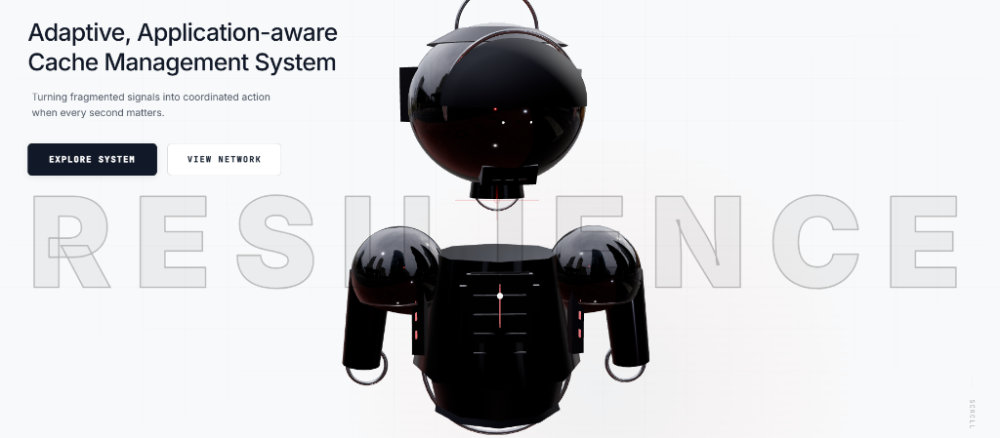
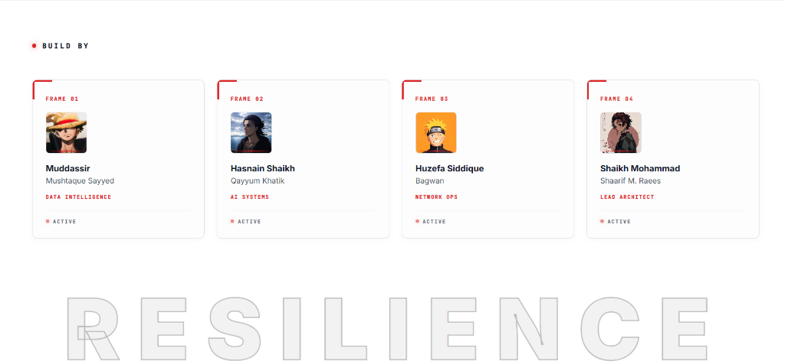

# ⚡ RESILIENCE

### *Adaptive, Application-aware Cache Management System*

[](https://react.dev/)
[](https://threejs.org/)
[](https://vitejs.dev/)
[](https://www.framer.com/motion/)
[](https://github.com/Muddassirsayyed/Frontend-For-Vcet-Hackathon-Mumbai)

> **"Turning fragmented signals into coordinated action when every second matters."**

**Resilience** is a next-generation, application-aware cache management interface built for high-throughput distributed systems. Designed to eliminate data synchronization bottlenecks, predict access spikes, and unify memory clusters across distributed nodes, Resilience transforms volatile signals into resilient, zero-loss performance.

---

## 📸 System Showcase & Visual Walkthrough

### 1. Interactive 3D Cybernetic Core (Hero Section)



#### 🔹 Architecture & Capabilities:
- **Real-Time 3D Cybernetic Unit**: Rendered with **React Three Fiber (R3F)** and **Three.js**, featuring high-gloss reflective mesh materials, procedural lighting, and contact shadows.
- **Dynamic Mouse-Tracking Parallax**: The cybernetic torso and head continuously calculate inverse kinematics and rotational limits to organically track user pointer coordinates with smooth mathematical interpolation (`lerp`).
- **Power-Up Activation Sequence**: Upon page load or reload, the 3D unit initiates a multi-stage power-up sequence: smoothly elevating from a lowered resting plane, tilting the head to horizon level, flaring cybernetic optical sensors (`emissiveIntensity`), and settling into continuous organic idle micro-breathing.
- **Minimalist Typographic Layout**: Clean, high-contrast headline positioned in the upper-left quadrant with custom cubic-bezier easing (`[0.22, 1, 0.36, 1]`) ensuring zero obstruction of the central 3D core.

---

### 2. Network Telemetry & Engineering Node Roster



#### 🔹 Architecture & Capabilities:
- **Active System Node Cards**: Structured into four distinct telemetry frames showcasing engineering division leads.
- **Cybernetic Scanning Overlays**: Each frame features an animated glowing red scan line dynamically passing across identity modules.
- **Custom Identity Matrix**:
  - **Frame 01 — Muddassir Mushtaque Sayyed**: *Data Intelligence* (Monkey D. Luffy Module)
  - **Frame 02 — Hasnain Shaikh Qayyum Khatik**: *AI Systems* (Eren Yeager Module)
  - **Frame 03 — Huzefa Siddique Bagwan**: *Network Ops* (Naruto Uzumaki Module)
  - **Frame 04 — Shaikh Mohammad Shaarif M. Raees**: *Lead Architect* (Tanjiro Kamado Module)
- **Monochrome Backdrop Watermark**: Dynamic outline typography anchoring the visual hierarchy.

---

## ✨ Core Features

- 🤖 **WebGL 3D Cybernetic Engine**: Custom Three.js procedural model with physical materials, environment maps, and dynamic lighting.
- ⚡ **Ultra-Smooth Animations**: Framer Motion transitions with custom cubic-bezier ease-out timing curves for luxurious, responsive interaction.
- 🖥️ **Live Telemetry Footer**: Minimal high-contrast dark dashboard monitoring simulated cluster metrics (`< 2ms latency`, `99.98% sync`, `4 active nodes`) with smooth "Back to Top" scrolling.
- 📱 **Fully Responsive Layout**: Adaptive layout engine optimized for ultra-wide displays down to mobile devices.
- 🎨 **Modern Cyber-Industrial Aesthetic**: High-tech typography (`Inter` + `JetBrains Mono`), delicate grid overlays, and clean monochrome styling.

---

## 🛠️ Technology Stack

| Layer | Technologies |
| :--- | :--- |
| **Frontend Framework** | [React 18](https://react.dev/) |
| **Build & Tooling** | [Vite 5](https://vitejs.dev/) |
| **3D Rendering** | [Three.js](https://threejs.org/), [@react-three/fiber](https://r3f.docs.pmnd.rs/), [@react-three/drei](https://github.com/pmndrs/drei) |
| **Animation Engine** | [Framer Motion](https://www.framer.com/motion/) |
| **Styling** | Modular CSS (CSS Modules), PostCSS |
| **Typography** | `Inter` (Sans-serif) & `JetBrains Mono` (Monospaced) |

---

## 📂 Project Structure

```text
├── docs/
│   └── screenshots/          # High-resolution walkthrough screenshots
│       ├── hero-section.png
│       └── network-team.png
├── public/
│   ├── hasnain.jpg           # Member 02 Avatar
│   ├── huzefa.png            # Member 03 Avatar
│   ├── muddassir.png         # Member 01 Avatar
│   └── shaarif.png           # Member 04 Avatar
├── src/
│   ├── components/
│   │   ├── Footer.jsx        # Telemetry & minimal dark footer
│   │   ├── Footer.module.css
│   │   ├── HeroSection.jsx   # Hero layout with 3D canvas and typography
│   │   ├── HeroSection.module.css
│   │   ├── Navbar.jsx        # Fixed glass header with dashboard CTA
│   │   ├── Navbar.module.css
│   │   ├── NetworkSection.jsx# Team node frames & status monitoring
│   │   ├── NetworkSection.module.css
│   │   ├── Robot.jsx         # 3D robot geometry, materials & animations
│   │   ├── RobotScene.jsx    # Canvas wrapper, lighting & camera rigs
│   │   ├── TechGrid.jsx      # Background procedural vector grid
│   │   └── TechGrid.module.css
│   ├── hooks/
│   │   └── useMouseRef.js    # Normalized pointer tracking hook
│   ├── App.jsx               # Application entry container
│   ├── main.jsx              # React DOM mounting
│   └── index.css             # Global reset and theme tokens
├── index.html                # HTML entry point
├── package.json              # Project dependencies & scripts
└── vite.config.js            # Vite configuration
```

---

## 🚀 Getting Started

### Prerequisites
Make sure you have **Node.js** (v18.0.0 or later) and **npm** installed on your system.

### 1. Clone Repository
```bash
git clone https://github.com/Muddassirsayyed/Frontend-For-Vcet-Hackathon-Mumbai.git
cd Frontend-For-Vcet-Hackathon-Mumbai
```

### 2. Install Dependencies
```bash
npm install
```

### 3. Start Development Server
```bash
npm run dev
```
Open [http://localhost:3000](http://localhost:3000) in your browser to experience the application live.

### 4. Production Build
```bash
npm run build
npm run preview
```

---

## 👥 Team Resilience (VCET Hackathon 2026)

| Frame | Member | Role |
| :---: | :--- | :--- |
| **01** | **Muddassir Mushtaque Sayyed** | Data Intelligence Lead |
| **02** | **Hasnain Shaikh Qayyum Khatik** | AI Systems Engineer |
| **03** | **Huzefa Siddique Bagwan** | Network Operations Lead |
| **04** | **Shaikh Mohammad Shaarif M. Raees** | Lead System Architect |

---

## 📄 License
This project is open source and available under the [MIT License](LICENSE).
